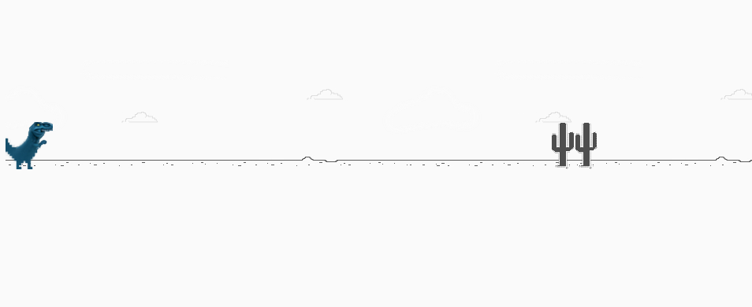
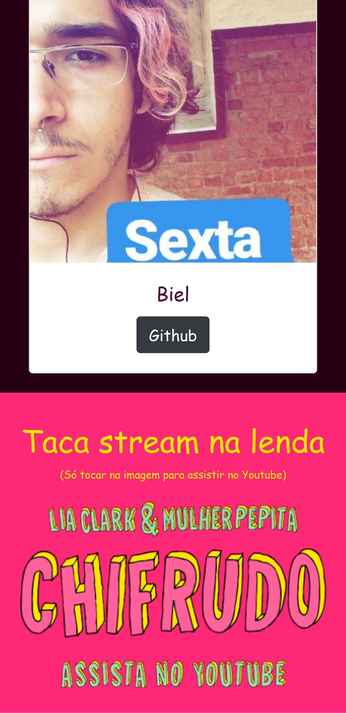

# Template web
template para usar nos estudos de web front-end.

Para testar a versão ao vivo, [clique aqui.](https://cursos-e-estudos.github.io/template-de-web/)
 

<b> Visual desktop </b>

  

 

---

 

<b> Visual mobile </b>

  &nbsp; &nbsp; &nbsp; &nbsp; &nbsp; &nbsp; &nbsp; &nbsp;
  

---

 

 [@SouVitorGabriel](https://github.com/souvitorgabriel) Projetos pessoais podem ser vistos no meu perfil.

 

 [@Cursos e Estudos](https://github.com/cursos-e-estudos) Outros estudos podem ser vistos aqui nessa organização.